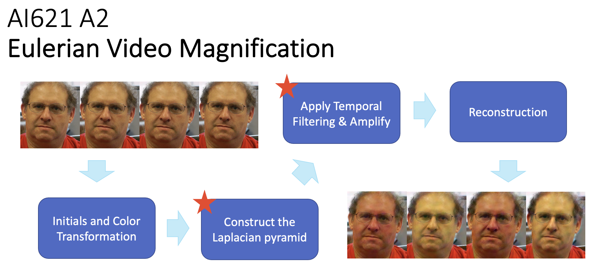
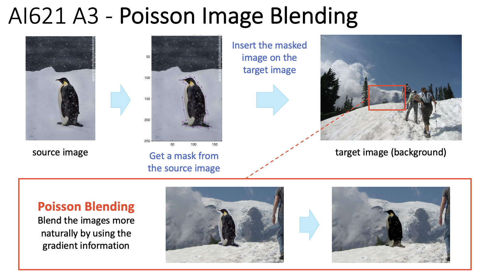
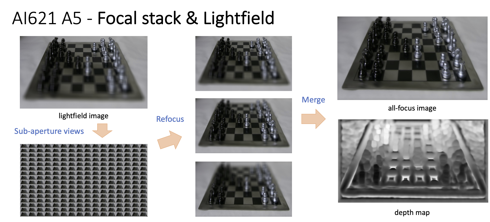

# AI621-Computational-Photography
Assignments for AI621 Computational Photography

## Assignment 1: Image Processing Pipeline
- [Report & Matlab code](https://onejoon.github.io/AI621-Computational-Photography/A1/A1_20215584.html)

## Assignment 2: Eulerian Video Magnification

- Report & Matlab code
  - [Face](https://onejoon.github.io/AI621-Computational-Photography/A2/A2_20215584_face.html)
  - [Baby2](https://onejoon.github.io/AI621-Computational-Photography/A2/A2_20215584_baby.html)
  - [Tree](https://onejoon.github.io/AI621-Computational-Photography/A2/A2_20215584_tree.html)
- [Youtube](https://youtu.be/mnL_L9QnCP0)
- [Paper: Eulerian Video Magnification for Revealing Subtle Changes in the World](http://people.csail.mit.edu/mrub/papers/vidmag.pdf)

## Assignment 3: Poisson Image Blending

- Report & Matlab code
  - [Toy Example - Reconstruction](https://onejoon.github.io/AI621-Computational-Photography/A3/A3_20215584_1-Toy.html)
  - [Poisson Blending](https://onejoon.github.io/AI621-Computational-Photography/A3/A3_20215584_2-Blending.html)
- [Youtube](https://youtu.be/gUB_7NJi8VY)

## Assignment 4: HDR Imaging & Tonemapping

- Report & Matlab code
  - [HDR Imaging: Linearization and Merging](https://onejoon.github.io/AI621-Computational-Photography/A4/A4_20215584_1-HDR.html)
  - [Tonemapping](https://onejoon.github.io/AI621-Computational-Photography/A4/A4_20215584_2-Tonemapping.html)
- [Youtube](https://youtu.be/TnPvvUt_sHQ)

## Assignment 5: Focal Stack & Lightfield

- [Report & Matlab code](https://onejoon.github.io/AI621-Computational-Photography/A5/A5_20215584_1.html)

---
Wonjoon Chang, PhD student in KAIST AI\
Student ID: 20215584\
e-mail: one_jj@kaist.ac.kr
